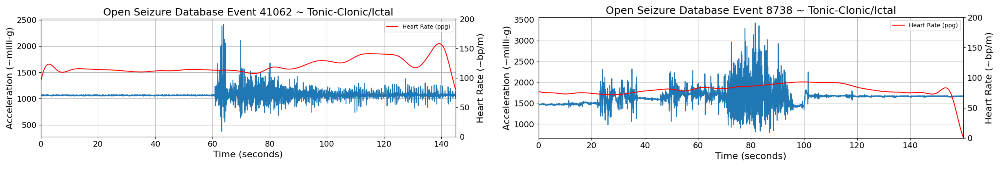
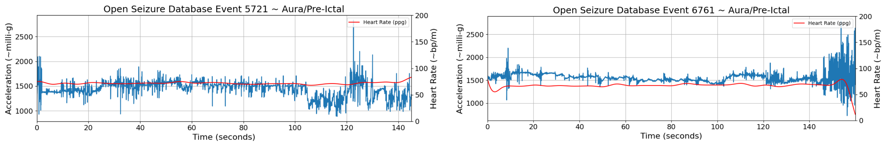
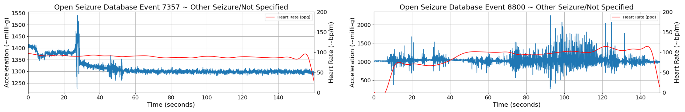
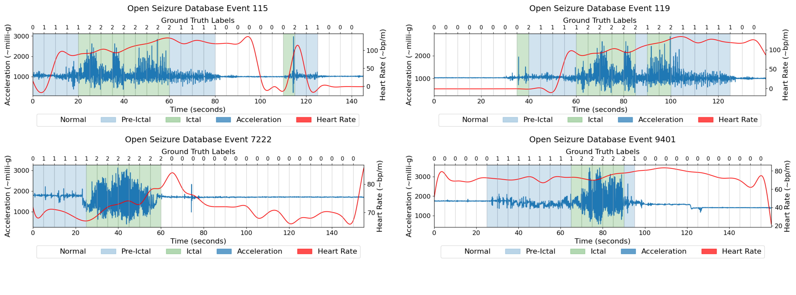

<small>
The Epilepsy Ictal Phase Detection Dataset is a specialised dataset derived from the Open Seizure Database (OSDB), a resource designed to facilitate research in non-EEG seizure detection. This dataset has been expertly annotated by clinical specialists to provide phase-specific labels for seizure events, making it a unique resource for research into the temporal dynamics of seizures. Each 5-second timestep of the recorded events has been labelled into one of three distinct phases: Normal (non-seizure), Pre-Ictal (pre-seizure), or Ictal (seizure). The Epilepsy Ictal Phase Detection dataset consists of 94 events, selected and annotated from the OSDB. These events are categorised by seizure as follows:

- 42 Generalized Tonic-Clonic (GTC) seizures



- 19 Auras/Focal seizures



- 33 seizures categorized as Other (seizures lacking additional subtype categorization)



</small>

<small>
The dataset represents non-EEG data collected from 18 participants diagnosed with generalized epilepsy. The total duration of the dataset is 5 hours, 29 minutes, and 5 seconds of annotated seizure activity, offering a substantial basis for research into seizure phase classification and detection.

---

### 📝 Annotated Class Labels

The events in this dataset were annotated by clinical experts based on their analysis of the patient/event data. Each event is classified into one of the following categories:

- **Normal** ⚪: Represents periods without any signs of seizure activity. (Label: `0`)
- **Pre-Ictal** 🔵: Represents the phase preceding a seizure, indicating early signs of seizure activity. (Label: `1`)
- **Ictal** 🟢: Represents the seizure phase, where clear seizure activity is observed. (Label: `2`)

These class labels were assigned to specific time windows based on expert interpretation. Clinicians were assisted by partial video footage showcasing the different ictal phases to aid in accurate labeling.

The script used to guide the annotation process can be found in the `Clinical_Guide/Clinicial_Annotation_Guide.ipynb` file. Below is a visual representation of the annotated events, where the x-axis shows the class labels for each event:



---

## 🚀 Getting Started

### 📋 Prerequisites
- Python >= 3.8
- Required libraries listed in `requirements.txt`

### ⚙️ Installation
1. **Clone this repository:**
   ```bash
   git clone https://github.com/jpordoy/Epilepsy-Ictal-Phase-Detection-Dataset.git
   cd Epilepsy-Ictal-Phase-Detection-Dataset
   ```

2. **Install dependencies:**
   ```bash
   pip install -r requirements.txt
   ```

---

## 📂 Dataset Access

### Request Access
To access the dataset, complete the [Dataset Access Form](#).  

### Download the Dataset
Once approved, download the dataset and place the files in the `Data/` directory:
```text
Epilepsy-Ictal-Phase-Detection-Dataset/
├── Data/
│   ├── sample_dataset.csv
│   ├── full_dataset.csv
```

---

## 🛠️ Usage

### 1️⃣Load the Dataset
Load the dataset from the specified path: 
```python  
# Specify the dataset path  
sample_dataset_path = 'Data/sample_dataset.csv'  
# Load the dataset  
df = pd.read_csv(sample_dataset_path)  
```

### 2️⃣ Initialize the DataLoader
Prepare the data for segmentation and processing:
```python
# Initialize the DataLoader  
data_loader = DataLoader(  
    dataframe=df,  
    time_steps=Config.N_TIME_STEPS,  
    step=Config.step,  
    target_column='label'  
)  
```

### 3️⃣  Segment the Data
Segment the dataset into windows of time-series data and corresponding labels:
```python
# Process the dataset with the DataLoader  
df_sample_data = data_loader.load_data() 
df_sample_data.head(5)
 ```
---

## 🤝 Contributing
We welcome and encourage contributions to enhance this repository!

If you would like to contribute research or insights related to the Ictal Phase Detection Dataset, please feel free. 

Access the Open Seizure Database (OSDB): The original OSDB, from which the events of this dataset are derived, can be accessed here.

Add Publications: If you have published work using the this dataset, please create a pull request and add your publication to the Publications folder in this repository. This helps to create a shared resource for the community and highlights the ongoing research based on this dataset.
For more details, refer to our Contribution Guidelines. 

Thank you for your valuable contributions!
---

## 📜 License

This project is licensed under the terms of the **Creative Commons Attribution 4.0 International License (CC BY 4.0)**. See the [LICENSE.md](./LICENSE.md) file for more details.
